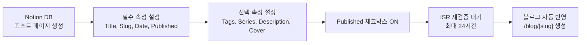

# 작성자 흐름

Notion에서 글을 작성하고 블로그에 반영되는 전체 흐름입니다.

## 발행 흐름

## Notion DB 필수 속성

| 속성 | Notion 타입 | 설명 |
| --- | --- | --- |
| `Title` | title | 포스트 제목. `post.title`로 사용. |
| `Slug` | rich_text | URL 경로. `/blog/[slug]`. 영문 소문자 + 하이픈 권장. |
| `Date` | date | 발행일. 포스트 정렬 기준. |
| `Published` | checkbox | **체크 시에만 `getAllPosts()`에 포함**. |

## Notion DB 선택 속성

| 속성 | Notion 타입 | 설명 |
| --- | --- | --- |
| `Description` | rich_text | 포스트 요약. OG description, PostCard 설명, JSON-LD에 사용. |
| `Tags` | multi_select | 태그 목록. `/blog/tag/[tag]` 페이지 생성 기준. |
| `Series` | rich_text | 시리즈명. BlogFilter 탭 · `/series/[name]` 페이지 기준. |
| `Views` | number | 조회수. `ViewTracker`가 방문마다 +1. `getPopularPosts()` 정렬 기준. |
| Cover image | Notion 페이지 커버 | `post.coverImage`로 HeroBanner 배경, RelatedPosts 썸네일에 사용. |

## 콘텐츠 작성 팁

- Notion 본문은 `notion-to-md`로 Markdown으로 변환됩니다.
- **Callout 블록**: 색상별 배경(`callout-blue`, `callout-yellow` 등)으로 렌더링됩니다.
- **Column 레이아웃**: `.notion-columns` → `display: flex` 로 렌더링됩니다.
- **코드 블록 언어 `mermaid`**: 다이어그램으로 렌더링됩니다.
- 이미지는 Notion 업로드 또는 외부 URL 사용. S3 URL(`prod-files-secure.s3...`)은 `next.config.js`의 `remotePatterns`에 등록됨.

## 발행 후 즉시 반영이 필요한 경우

ISR `revalidate = 86400`이므로 새 글이 바로 보이지 않을 수 있습니다.

- Vercel 대시보드 → Functions → On-demand ISR revalidation 사용.
- 또는 `npm run build` + 재배포.

## 방명록 관리

- Notion Guestbook DB에서 직접 관리.
- 비밀 글: `Password` rich_text 속성에 비밀번호 저장.
- 댓글: 포스트의 paragraph block children (`name|message` 형식).
- 어드민 PIN: `.env.local`의 `ADMIN_PIN` — 비밀 글 전체 열람 가능.
