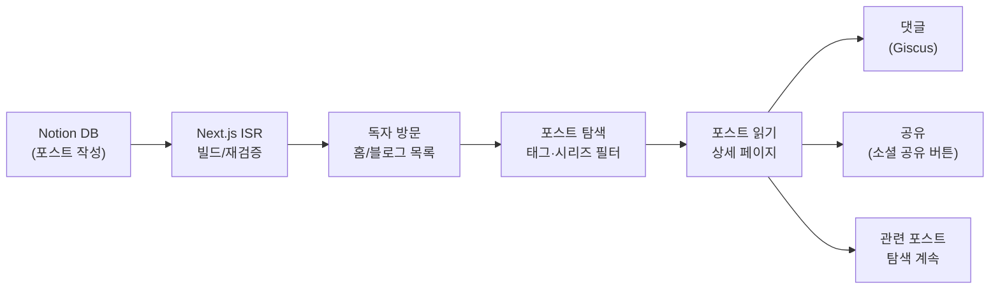

# yerim.dev 전체 흐름

yerim.dev는 Notion을 CMS로 사용하는 Next.js 14 App Router 개인 기술 블로그입니다.

## 핵심 구조



## 진입점별 흐름

| 진입점 | 목적 | 상세 문서 |
| --- | --- | --- |
| 독자 | 포스트 탐색 → 읽기 → 댓글/공유 | [reader-flow.md](reader-flow.md) |
| 작성자 | Notion에서 글 작성 → 블로그 자동 반영 | [author-flow.md](author-flow.md) |

## 데이터 흐름 요약

```
Notion DB
  └─ lib/notion.ts (React cache() 중복 방지)
       ├─ getAllPosts()       → 홈, /blog, /blog/tag/[tag]
       ├─ getPostBySlug()    → /blog/[slug]
       ├─ getPostContent()   → PostBody 렌더링
       ├─ getPopularPosts()  → HeroBanner, Sidebar
       ├─ getAllTags()        → /blog/tag/[tag] 정적 생성
       └─ getAllSeries()      → BlogFilter 탭

Notion Guestbook DB
  └─ lib/guestbook.ts
       └─ /guestbook 페이지

GitHub GraphQL
  └─ lib/github.ts
       └─ Giscus 댓글 수, 최근 댓글 (Sidebar)
```

## ISR 재검증 주기

| 페이지 | revalidate |
| --- | --- |
| `/` (홈) | 3600초 (1시간) |
| `/blog` | 86400초 (24시간) |
| `/blog/[slug]` | 86400초 (24시간) |
| `/blog/tag/[tag]` | 3600초 (1시간) |
| `/series`, `/series/[name]` | 86400초 (24시간) |
| `/rss.xml` | 86400초 (24시간) |

## 개발자가 같이 봐야 하는 문서

| 주제 | 참조 |
| --- | --- |
| 라우트 전체 목록 | [../domains/route-map.md](../domains/route-map.md) |
| Notion DB 스키마 · lib 함수 | [../domains/data-layer.md](../domains/data-layer.md) |
| 컴포넌트 구조 | [../domains/components.md](../domains/components.md) |
| SEO · JSON-LD · RSS | [../domains/seo.md](../domains/seo.md) |
| 스타일 시스템 | [../domains/styling.md](../domains/styling.md) |
