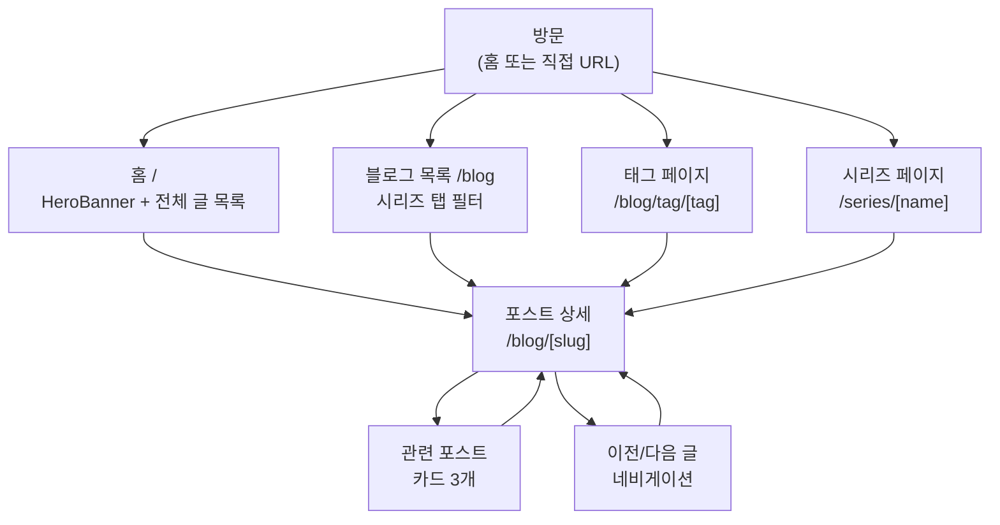

# 독자 흐름

독자가 블로그에 방문해 포스트를 읽고 상호작용하는 전체 흐름입니다.

## 탐색 흐름



## 홈 (`/`)

- **HeroBanner**: 조회수 상위 5개 포스트 자동 슬라이드 (4초 간격). 커버 이미지 배경 사용.
- **전체 아티클**: BlogFilter 컴포넌트. 시리즈 탭 클릭 시 `/series/[name]`으로 URL 이동.
- **사이드바**: 인기글 (조회수 기준 상위 3개), 최근 댓글 (GitHub Giscus), About 카드.
- 모바일에서는 사이드바 숨김 (`.home-sidebar { display: none }`).

## 블로그 목록 (`/blog`)

- **시리즈 탭**: "전체" + 각 시리즈명. 클릭 시 URL 이동 없이 컴포넌트 내에서 즉시 필터링.
  - `useState(selected)`로 선택된 시리즈 추적.
  - 같은 탭 재클릭 시 전체로 복귀.
  - 탭이 화면 너비를 초과하면 좌우 스크롤 (스크롤바 숨김).
- 전체 포스트를 발행일 내림차순으로 표시.

## 태그 페이지 (`/blog/tag/[tag]`)

- 해당 태그가 달린 포스트 목록.
- `generateStaticParams`로 모든 태그에 대해 정적 생성.
- `generateMetadata`로 `#태그명` 타이틀과 한국어 description.
- 포스트 0개이면 404.

## 시리즈 페이지 (`/series/[seriesName]`)

- 해당 시리즈 포스트를 번호(`01`, `02`, ...) + 제목 + 날짜 형태로 표시.
- `decodeURIComponent`로 한국어 시리즈명 처리.

## 포스트 상세 (`/blog/[slug]`)

방문 시 발생하는 동작:

1. `ViewTracker` — 마운트 시 `/api/views/[slug]` POST → Notion `Views` +1.
2. `ReadingProgress` — 스크롤 위치 기반 상단 3px 바 업데이트.
3. `MediumZoom` — `.post-body img` 전체에 클릭 시 확대 연결.

포스트 헤더 구성:
- 시리즈 배지 (클릭 → `/series/[name]`)
- 태그 링크 (클릭 → `/blog/tag/[tag]`)
- 제목, 설명
- 발행일 · 읽기 시간 · 조회수 · **소셜 공유 버튼**

본문:
- `PostBody` — `react-markdown` + `remark-gfm` + `rehype-highlight` + `rehype-slug`
- ` ```mermaid ` 블록 → `MermaidBlock` (동적 import)
- `pre` 블록 → `CopyButton` 오버레이

하단 (본문 → AdSense → 관련 포스트 → 이전/다음 → 댓글):
- `GoogleAdsense` — `NEXT_PUBLIC_ADSENSE_PUBLISHER_ID` 없으면 렌더하지 않음.
- `RelatedPosts` — 같은 시리즈 우선, 태그 교집합 크기 내림차순, 최대 3개.
- `PostNavigation` — 이전/다음 포스트 (발행일 기준).
- `GiscusComments` — GitHub Discussions 기반 댓글.

## 기타 페이지

| 페이지 | 주요 기능 |
| --- | --- |
| `/guestbook` | 방명록. 공개/비밀 글, 댓글, 비밀번호. `force-dynamic`. 모바일 허용. |
| `/notices` | 공지사항. Accordion 목록. 신규 배지. Client Component. |
| `/about/[version]` | About. `fe`/`be`/`pm` 버전 전환. 타이프라이터 텍스트. |
| `/project` | 프로젝트 포트폴리오 목록. |
| `/series` | 시리즈별 카드 그리드. |
